# Problem statement

The [original BlueDot Technical AI Safety Puzzle 1 problem
statement](https://github.com/SamDower/bluedot-tais-puzzle#readme) supplies a
classifier for short English texts. It predicts eight binary features
simultaneously; the features are not mutually exclusive, and the supplied model
achieves more than 95% accuracy on each:

- `number`: contains a digit or written-out number;
- `question`: is phrased as a question;
- `color`: contains a color word;
- `food`: mentions food;
- `sentiment`: expresses positive rather than negative sentiment;
- `country`: contains a country name;
- `person`: contains a person's name; and
- `body_part`: contains a body-part word.

The model is `sentence-transformers/all-MiniLM-L6-v2`, mean-pooled to a
384-dimensional sentence embedding, followed by four 64-dimensional ReLU hidden
layers and an eight-logit multilabel output. The puzzle designates layer `L` as
the activation after the third ReLU (`hidden 2`, called `h2` below). Seven labels
are represented linearly at `L`: one direction in activation space describes
each label. One unknown feature `F` is represented differently.

The required tasks are:

1. **Find `F`:** identify which of the eight features is not represented
   linearly at `L`.
2. **Explain the representation:** describe the geometry used to represent `F`
   at `L` and show the analysis supporting that conclusion.
3. **Train a stranger representation:** train a model that encodes `F`, or
   another feature, in a representation more interesting than the supplied
   model's representation; define and defend "more interesting."

The supplied evidence is `model.pt`, 7,000 training texts, 1,500 held-out test
texts, and the label ordering in `feature_names.json`. The requested submission
is one document recording what was tried, what worked, what failed, and what
structure emerged. This report is self-contained with respect to those
requirements; the link above identifies the authoritative original wording and
starter code, also preserved in an [immutable upstream
snapshot](https://github.com/SamDower/bluedot-tais-puzzle/blob/05d7afcedbb7c2486ad4d87ffa3855cbfcd94806/README.md).

# Summary

The unusual feature is **`country`**. At the specified hidden layer (`h2`), a
linear probe is at chance (`0.471`) while a nonlinear probe reaches `0.966`.
The simplest high-performing geometric account is a one-dimensional interval
code on the model's `food` direction: the sign carries food, while the magnitude
largely carries country. A raw signed projection predicts country at `0.502`,
whereas its absolute value and square both reach `0.946`.

For Task 3, I trained a two-dimensional, unit-norm circular bottleneck on MNIST.
Digit classes occupy successive angles, so even and odd digits alternate around
the circle. After freezing the architecture, hyperparameters, split, and five
seeds using validation data only, I evaluated once on the additional 50,000
QMNIST test examples. The mean even/odd accuracy was `0.537` for a linear probe
and `0.958` for a nonlinear probe. This is a robust nonlinear advantage, though
not perfect linear-probe immunity in every seed.

# Task 1: Finding the unusual feature

I cached activations at the sentence embedding, each post-ReLU hidden layer, and
the logits. For every feature and layer I trained:

- a logistic-regression probe; and
- a one-hidden-layer MLP probe.

Both probes were fit on the supplied training examples and scored on the supplied
held-out examples. `country` is the only feature with a large linear/nonlinear
gap at `h2`.

| Feature | Linear probe | Nonlinear probe | Gap |
|:--|--:|--:|--:|
| **country** | **0.471** | **0.966** | **0.495** |
| question | 1.000 | 1.000 | 0.000 |
| food | 0.984 | 0.984 | 0.000 |
| person | 0.999 | 0.999 | 0.000 |
| body_part | 0.981 | 0.981 | 0.000 |
| sentiment | 0.981 | 0.981 | -0.001 |
| color | 0.973 | 0.972 | -0.001 |
| number | 0.975 | 0.974 | -0.001 |

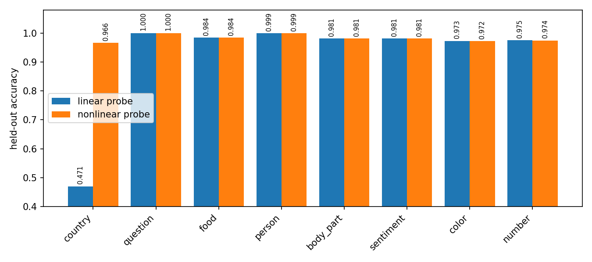{width=95%}

The layer trace localizes the phenomenon. Country is linearly decodable before
`h2`, nonlinear only at `h2`, and linearly decodable again at `h3` and the
logits.

| Tap | Linear | Nonlinear |
|:--|--:|--:|
| embedding | 0.993 | 0.991 |
| h0 | 0.989 | 0.991 |
| h1 | 0.993 | 0.991 |
| **h2** | **0.471** | **0.966** |
| h3 | 0.964 | 0.970 |
| logits | 0.963 | 0.965 |

Three checks make a template artifact unlikely. Leave-one-template-out scoring
gives `0.486` linear versus `0.995` nonlinear; a whitened-PCA control gives
`0.503` versus `0.971`; and shuffled country labels return to chance. These are
probe results, not by themselves proof that the model causally uses every
measured feature [1]. Here the supplied classifier's own country output also
reaches `0.964`, showing that the information is behaviorally available.

# Task 2: Geometry of country at h2

## A magnitude code on the food direction

Let `z` be the standardized `h2` activation and let `w_food` be a logistic
regression direction fit to predict food on training data. I measured the scalar
projection

$$p = w_{food}^{T} z.$$

The sign of `p` tracks food. Country changes the magnitude: country-positive
examples lie nearer zero, while country-negative examples lie farther out on
either side. The direction's sign is arbitrary; the symmetric magnitude pattern
is the relevant fact.

| Country | Food | Mean held-out projection |
|:--:|:--:|--:|
| 0 | 0 | -21.8 |
| 0 | 1 | +18.9 |
| 1 | 0 | -5.0 |
| 1 | 1 | +4.4 |

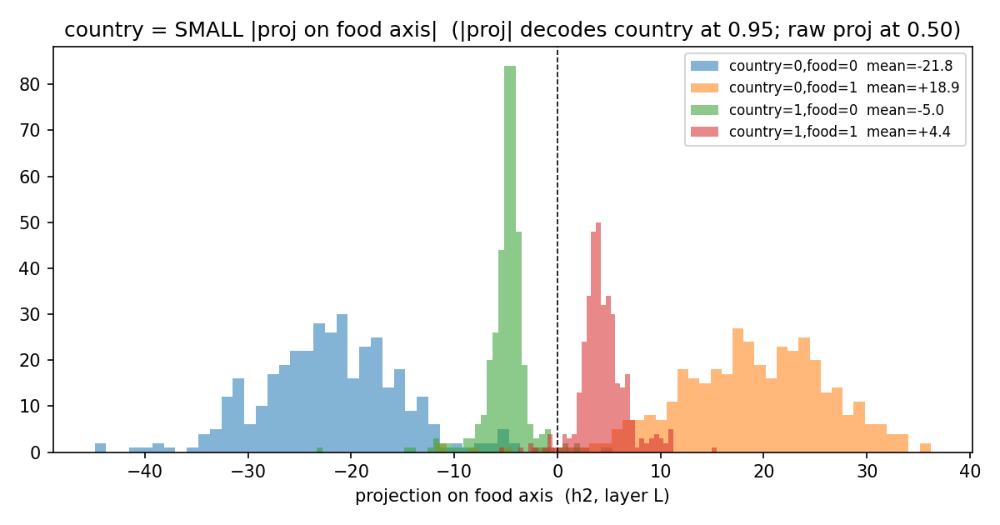{width=95%}

A one-dimensional decoder isolates the symmetry:

| Input to logistic decoder | Country accuracy |
|:--|--:|
| $p$ | 0.502 |
| $|p|$ | **0.946** |
| $p^2$ | **0.946** |

Country directions fit separately within `food=0` and `food=1` have cosine
similarity `-0.985`. Thus the country direction reverses when food changes, as
expected if food supplies sign and country supplies magnitude. I therefore
summarize the geometry as a **primarily one-dimensional, sign-symmetric interval
code aligned with the food direction**. The word "primarily" matters: `0.946`
is strong but not exact, and this analysis does not prove that a single scalar
accounts for every country-relevant computation.

This resembles the absolute-value computation studied in toy models of
superposition, where opposite ReLU branches can recover a sign-symmetric
quantity [2]. It does not establish why this classifier learned the code. In
particular, eight binary labels in 64 dimensions do not by themselves establish
capacity pressure, so I make no capacity-causation claim.

## What the next layer does, and does not show

The nonlinear code does **not** persist to the output: country is linearly
decodable at `h3` (`0.964`) and at the logits (`0.963`). Two `h3` neurons have
large, opposite input-weight alignment with the food direction. A newly fit
logistic probe on those two activations scores `0.895`, but that is correlational.
Using the trained model's actual country-output weights, those two neurons alone
score only `0.517`. Replacing them with their training means leaves accuracy at
`0.967`, compared with `0.964` unablated. They carry country-correlated
information, but they are neither sufficient under the trained readout nor shown
to be necessary. I therefore do not call them a two-neuron decoder.

I also discard an earlier "exact rank-1 bilinear" claim. Squaring one selected
projection constructs an outer-product matrix of rank one by definition. With
the separately fit unstandardized direction, that decoder reaches only `0.727`;
it is a rank-1 quadratic approximation, not an exact account of the classifier.

## Complete Tasks 1 and 2 analysis record

The headline account above was selected from the following analyses. This table
includes null results and failed interpretations, not only supporting evidence.
All probe fits use training data and all reported scores use the supplied 1,500
example test split unless explicitly marked as cross-validation.

| Analysis | Measured result | What it established, or failed to establish |
|:--|:--|:--|
| Supplied-model sanity check (`01_sanity.csv`) | Per-feature accuracy ranges from `0.964` (`country`) to `1.000` (`question`). | The fixed classifier performs the advertised multilabel task before its representations are interpreted. |
| Probe-family comparison (`02_linear.csv`, `03_gap.csv`, `04a_significance.csv`) | At `h2`, logistic country accuracy is `0.471`; the best of logistic regression, linear SVM, and LDA is `0.507`. The MLP reaches `0.966`. All seven other features have a linear/nonlinear gap no larger than `0.003` across the broader probe comparison. | The result is not peculiar to one weak linear estimator. |
| Template controls (`04b_loto.csv`) | Leave-one-template-out: linear `0.486`, nonlinear `0.995`; mean within-template linear accuracy `0.491`. | Neither memorizing templates nor mixing template families explains the gap. |
| Placebo, shuffle, sample-size, and PCA controls (`04c_controls.csv`) | Random placebo labels score `0.494` linear / `0.479` nonlinear; shuffled country scores `0.495` nonlinear. From `n=700` to `n=7,000`, nonlinear accuracy stays `0.957`-`0.966` while linear stays `0.467`-`0.518`. Whitening/PCA gives `0.503` / `0.971`. | The nonlinear score is not generic overfitting, a small-sample artifact, or a coordinate-scaling artifact. |
| Layer trace (`04d_layer_trace.csv`) | Country linear accuracy is `0.993` at the embedding, `0.989` at `h0`, `0.993` at `h1`, `0.471` at `h2`, `0.964` at `h3`, and `0.963` at the logits. | Nonlinearity is localized to `h2`; it is not a property of the label throughout the network. |
| Decoder capacity (`05_capacity.csv`) | A one-unit ReLU MLP reaches only `0.721`; two units reach `0.950`; widths 3-16 stay `0.950`-`0.965`. | A small piecewise-linear decoder is sufficient, consistent with two opposite branches, but this alone does not identify the trained circuit. |
| Conditional linear probes (`05_conditional.csv`) | Splitting by `food` raises within-subset country accuracy to `0.949`; splitting by sentiment gives `0.872`; every other split gives `0.506`-`0.616`. | Food is the dominant variable that unmasks a signed country direction. Sentiment is a weaker correlate, not a complete account. |
| Sign-gating attempt (`05_gating.csv`) | A learned binary sign mask scores `0.534`; the continuous linear baseline scores `0.471`; a nonlinear decoder on the sign mask also scores `0.534`. | Sign alone does not carry country. This rejected a simple two-half-space gating explanation. |
| Country/food statistics (`06_country_food.csv`) | Label correlation is `-0.005`; country XOR food accuracy is `0.517`; conditional country directions have cosine `-0.985`. | The labels are statistically independent. Their coupling is learned representational entanglement, not a dataset correlation or literal XOR target. |
| Magnitude mechanism (`07_mechanism.csv`) | Raw food-axis projection: `0.502`; absolute projection: `0.946`; squared projection: `0.946`. | This is the strongest simple geometric account: food supplies sign and country largely supplies distance from zero. |
| Candidate `h3` circuit (`07b_h3_circuit.csv`) | Two aligned neurons score `0.895` with a newly fit probe, but only `0.517` through the model's own readout. Mean-ablation accuracy is `0.967` versus `0.964` unablated. | The neurons are correlated with country but are neither sufficient under the trained readout nor necessary by this ablation. The proposed two-neuron causal decoder failed. |
| Rank-1 quadratic approximation (`22_cpd_analytic.csv`) | Raw projection `0.498`, absolute projection `0.598`, squared projection `0.727`; the constructed quadratic matrix has rank 1. | Rank 1 follows from squaring one projection. The lower accuracy rejects the earlier claim that this separately fit direction is an exact model mechanism. |

# Task 3: An interleaved circular representation

## Construction

A small CNN maps each MNIST image to a two-dimensional bottleneck `b`, normalized
so that $\lVert b\rVert_2=1$. For digit class $k$, a geometry loss targets angle

$$\theta_k = \frac{2\pi k}{10}$$

A linear ten-class head predicts the digit [4]. The derived binary feature is parity:
even digits are classes `0, 2, 4, 6, 8`, and odd digits are `1, 3, 5, 7, 9`.
They alternate around the unit circle, so parity occupies five disjoint angular
regions rather than one half-space. Unit normalization is essential because it
prevents radius from becoming a linear shortcut.

## Frozen evaluation protocol

The original exploratory run repeatedly inspected a random split of all 70,000
MNIST examples. Because that split included canonical MNIST test images, I treat
all results from it as contaminated and do not report them as held-out evidence.

The corrected protocol was fixed before the confirmatory audit:

- canonical MNIST training partition only;
- stratified 50,000/10,000 train/validation split, split seed `17291`;
- training seeds `11, 29, 47, 71, 101`;
- 30 epochs, Adam learning rate `0.001`, batch size `256`;
- geometry-loss weight `1.0`;
- fixed epoch count, with no checkpoint or seed selection on audit outcomes; and
- a single confirmatory evaluation on QMNIST `test50k`, the 50,000 additional
  reconstructed test digits that do not duplicate the standard MNIST test set
  [3].

Training code never loads QMNIST. The audit script refuses to run if its result
CSV already exists. Its first invocation stopped before predictions or metrics
because raw QMNIST targets expose eight metadata columns; class-column extraction
was unit-tested, then the unchanged frozen checkpoints were evaluated once.
Checkpoint SHA-256 hashes and the event are recorded in the audit artifacts.

## Confirmatory results

| Metric on QMNIST test50k | Mean | SD | 95% CI |
|:--|--:|--:|:--|
| Direct ten-class head | 0.860 | 0.059 | [0.786, 0.934] |
| Refit linear ten-class probe | 0.949 | 0.026 | [0.916, 0.981] |
| Even/odd linear probe | **0.537** | 0.042 | [0.485, 0.590] |
| Even/odd nonlinear probe | **0.958** | 0.023 | [0.930, 0.986] |
| Even/odd majority baseline | 0.506 | 0.000 | [0.506, 0.506] |

The intervals summarize variation across five training seeds as
$\bar{x} \pm t_{0.975,4}s/\sqrt{5}$ with $t_{0.975,4}=2.776$; they are not
per-example binomial intervals.

| Seed | Validation digit | Audit digit | Audit parity linear | Audit parity nonlinear |
|--:|--:|--:|--:|--:|
| 11 | 0.811 | 0.810 | 0.495 | 0.925 |
| 29 | 0.798 | 0.795 | 0.510 | 0.965 |
| 47 | 0.878 | 0.876 | 0.525 | 0.979 |
| 71 | 0.945 | 0.943 | 0.601 | 0.976 |
| 101 | 0.881 | 0.877 | 0.555 | 0.945 |

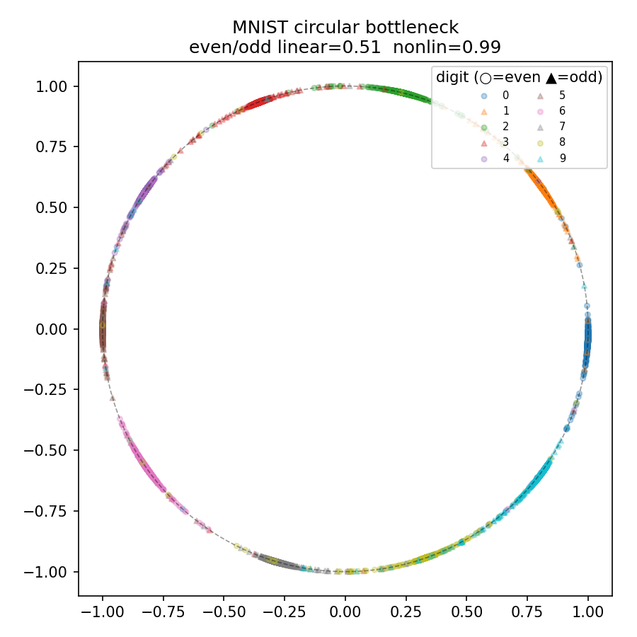{width=82%}

The mean nonlinear-minus-linear parity gap is `0.421`; every seed has a gap of
at least `0.374`. The nonlinear result is consistently high. The linear result
is near the majority baseline on average, but seed 71 reaches `0.601`, so the
defensible claim is **strong and repeatable nonlinear advantage from circular
interleaving**, not universal chance-level linear probing. Direct-head digit
accuracy is also seed-sensitive (`0.795` to `0.943`), while a refit linear digit
probe averages `0.949`; this is a limitation of optimization in the frozen run,
not something removed after seeing audit data.

## Complete Task 3 experiment record

The circular MNIST model above was the final confirmatory experiment. For
completeness, the table below records every preceding and subsequent Task 3
family, including failures. Except for Idea 6's frozen MNIST/QMNIST protocol,
Ideas 1-5 and 7-12 belong to architecture search: they repeatedly used the
supplied test activations, usually with one seed. Their numbers are useful for
explaining what was tried and what geometry appeared, but they are
test-contaminated exploratory evidence rather than independent held-out results.
No run was promoted or omitted because of its test score.

| Idea | Construction and artifacts | Main measured result | Verdict and observed structure |
|--:|:--|:--|:--|
| 1 | Add `sentiment XOR question` as a ninth text label (`08`, `09`). | Base `0.505`; linear probe `0.951`; MLP probe `0.982`. | **Failed.** The network solved the nonlinear target but made it linearly accessible at `h2`; label-level XOR does not imply XOR geometry internally. |
| 2 | Force binary country toward two angles in a learned 2-D plane (`10`, `11`). | Mean angles `1.0` and `89.4` degrees; linear `0.989`; angular decoder `0.988`. | **Geometric partial, probe-resistance failure.** The intended rotation appeared, but two clusters are separable by a line. Unequal radii (`6.24` and `3.67`) also supplied a shortcut. |
| 3 | Predict `h2` from the other seven labels and probe the residual (`12`, `13`). | Country probe: original `h2` `0.471`, residual `0.551`; reported linear unexplained fraction `0.000425`. | **Failed as a new encoding.** This label-conditioned predictor mostly erased country; it did not create a context-dependent country code. It is JEPA-inspired only in predicting a latent target, not a standard masked-latent JEPA. |
| 4 | Impose a three-dimensional helical target for binary country (`14`, `15`). | Base `0.503`; one-coordinate probe `0.989`; 2-D angular and 3-D probes both `0.993`. | **Failed.** Binary supervision populated a linearly easy part of the nominal helix; one coordinate already decoded the label. A helix needs a genuinely multi-valued phase variable and coverage constraints. |
| 5 | Prescribe a shared 2-D country/food superposition code (`16`, `17`). | Bottleneck probes: country `0.978`, food `0.738`. Country/food cells had broad and unequal angular spreads. | **Partial geometry, failed probe resistance.** The learned cloud did not retain the intended interleaved four-cell layout, and country became almost perfectly accessible. |
| 6 | Place ten MNIST classes at successive unit-circle angles; define parity by alternating classes (`18`, `19`). | Frozen QMNIST audit over five seeds: parity linear `0.537 +/- 0.042`; nonlinear `0.958 +/- 0.023`. | **Confirmatory success.** Unit normalization removed radius leakage and ten populated classes created five alternating parity regions. Seed 71 still leaked linearly (`0.601`), so the claim is a robust advantage, not perfect immunity. |
| 7 | Fit a 256-feature sparse autoencoder to the supplied model's `h2` (`20`, `21`). | Top sparse features alone: `0.519`, `0.592`; top pair linear/nonlinear: `0.707`/`0.717`; all features: `0.827`/`0.958`. | **Diagnostic, not a new encoding.** Country remained distributed across many sparse features; the SAE did not isolate a small country circuit or preserve the original linear-probe resistance. |
| 8 | Analyze a rank-1 quadratic approximation, then train bilinear XOR and bilinear text models (`22`-`26`). | Approximation: raw `0.498`, absolute `0.598`, square `0.727`. Bilinear XOR: `0.963`/`0.977`; bilinear-text country: `0.993`/`0.992`. | **Failed to produce a stranger hidden code.** The constructed outer product is rank 1 by definition, but is not exact. The bilinear architecture computes the interactions while exposing them linearly. |
| 9 | Train unit-norm text bottlenecks with dimensions 4 and 2, without target angles (`27`, `28`). | `d=4` person: linear `0.485`, nonlinear `0.907` (gap `0.421`). `d=2` country: `0.677`/`0.858`; its largest angular fit was harmonic `k=2`, $R^2=0.486$. | **Mixed emergent result.** Capacity pressure spontaneously hid `person` in 4-D and put country/food/sentiment into repeated arcs in 2-D, but several other labels were squeezed toward chance and country did not match the baseline's resistance. |
| 10 | Constrain the country readout on a unit circle to harmonic $k=1,\ldots,5$ (`29`, `30`). | Best nonlinear gap at `k=2`: linear `0.711`, nonlinear `0.959`, overall eight-label accuracy `0.719`. At `k=1`, both probes were near chance; at `k>=3`, linear accuracy was `0.961`-`0.987`. | **Partial.** `k=2` produced repeated arcs but leaked a linearly readable component. At `k=1` country was not encoded; at higher $k$ the representation collapsed to linearly easy clusters. A harmonic readout alone did not enforce harmonic geometry. |
| 11 | Multiplex country, food, and sentiment onto harmonics `2`, `3`, and `4` of one angle (`31`, `32`). | Country `0.529`/`0.525`; food `0.937`/`0.939`; sentiment `0.598`/`0.867`. | **Failed for country; partial for sentiment.** Country collapsed rather than becoming hidden, food stayed linear, and only sentiment occupied its intended high-frequency mode. Unconstrained question signal dominated cheap harmonics ($R^2=0.773$ at `k=1`, `0.823` at `k=2`). |
| 12 | Regularize binary country toward two nominally linked rings in 3-D, with food as phase (`33`, `34`). | Country linear `0.533`, nonlinear `0.940`; overall accuracy `0.806`; only `4/12` angular bins substantial; coordinate SDs `[1.106, 0.139, 0.142]`; `topology_verified=False`. | **Probe gap, topology failure.** The cloud was mostly one-dimensional. Binary food supplied only two target phases, and post-hoc point ordering cannot establish a linking number. The earlier claim of verified linked rings is retracted. |

The sequence exposes a consistent failure mode. A binary label can satisfy a
nominally circular, helical, harmonic, or ring-shaped objective by occupying only
one or two easy regions. Those regions are usually linearly separable, or the
feature disappears entirely. The confirmatory MNIST construction avoids this by
using ten supervised classes to populate the full unit circle before deriving a
binary parity label. The `d=4` bottleneck is the most interesting emergent text
result, but it hides `person`, not country, and trades away performance on some
other labels.

### Diagnostics from all exploratory geometries

The plots below are the checked-in diagnostics for every Task 3 family not
already shown in Figure 3. They are included even when the intended structure
did not emerge; captions report the failure rather than the training target.

::: {.experiment-gallery}
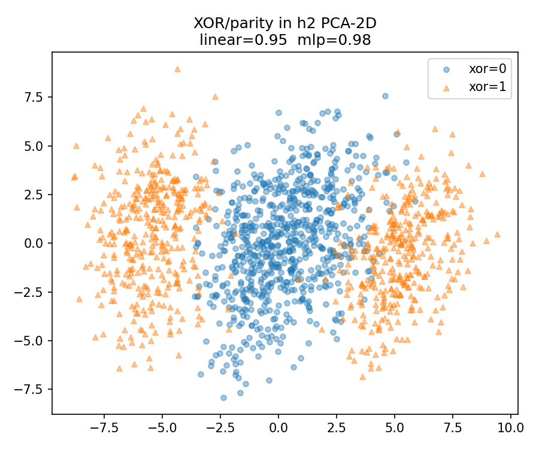{width=100%}

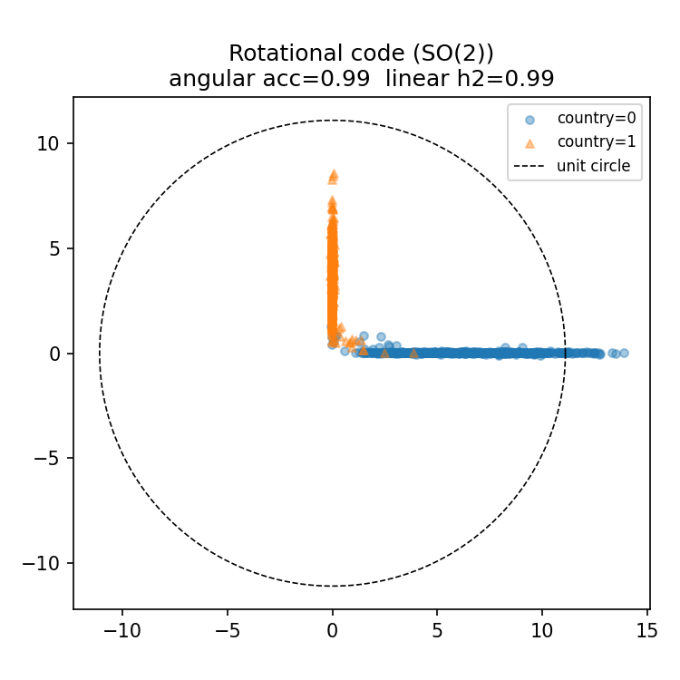{width=100%}

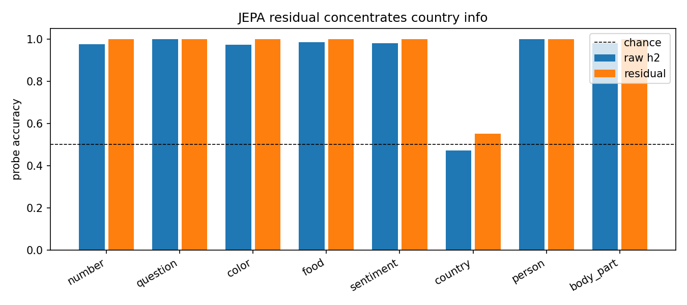{width=100%}

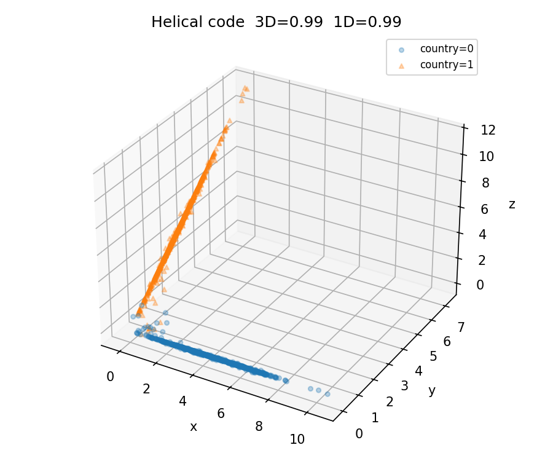{width=100%}

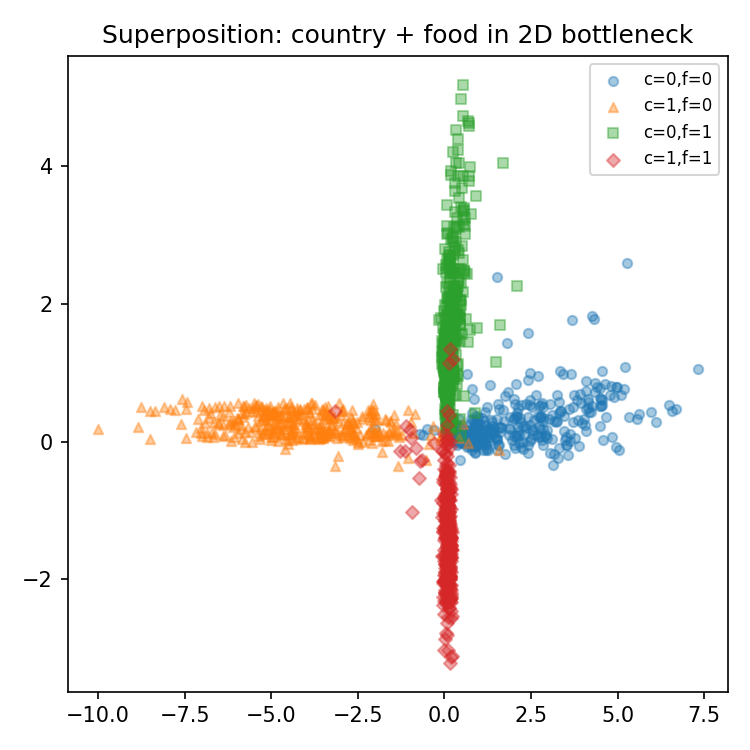{width=100%}

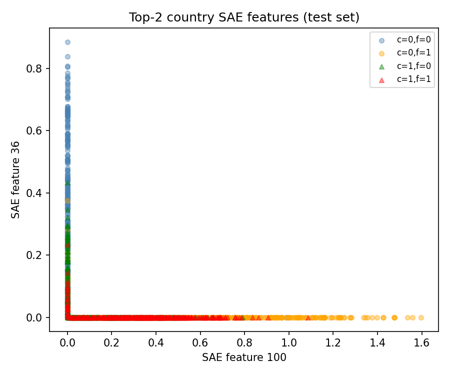{width=100%}

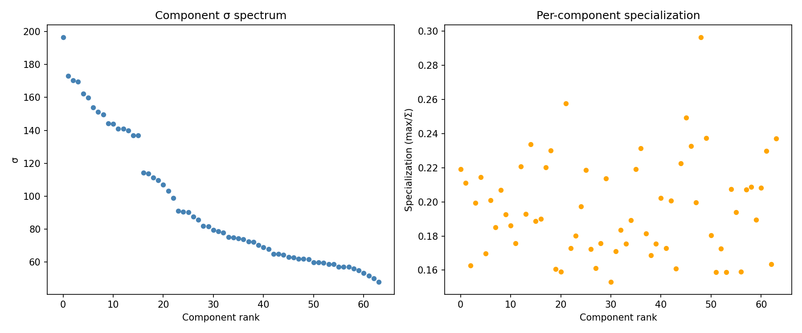{width=100%}

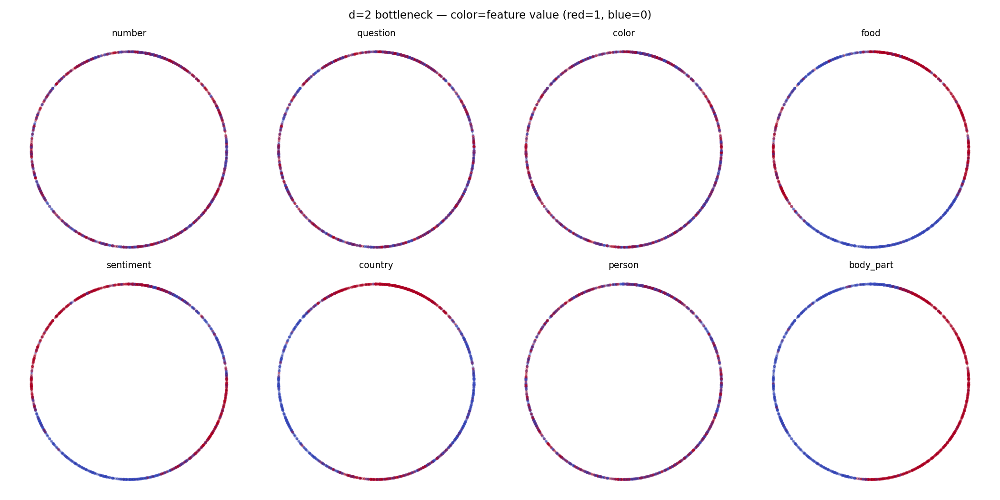{width=100%}

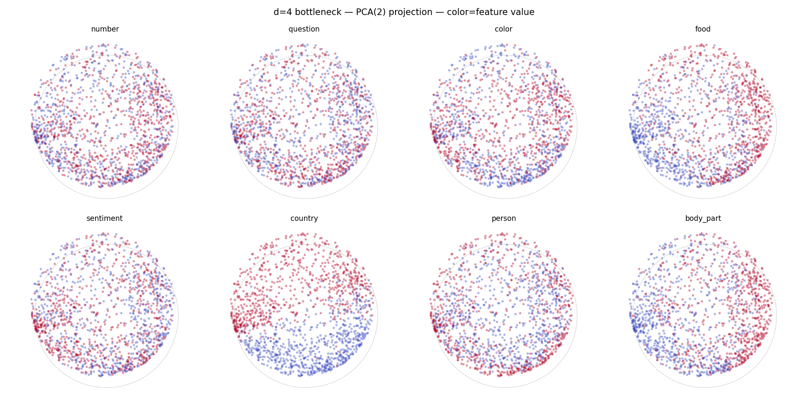{width=100%}

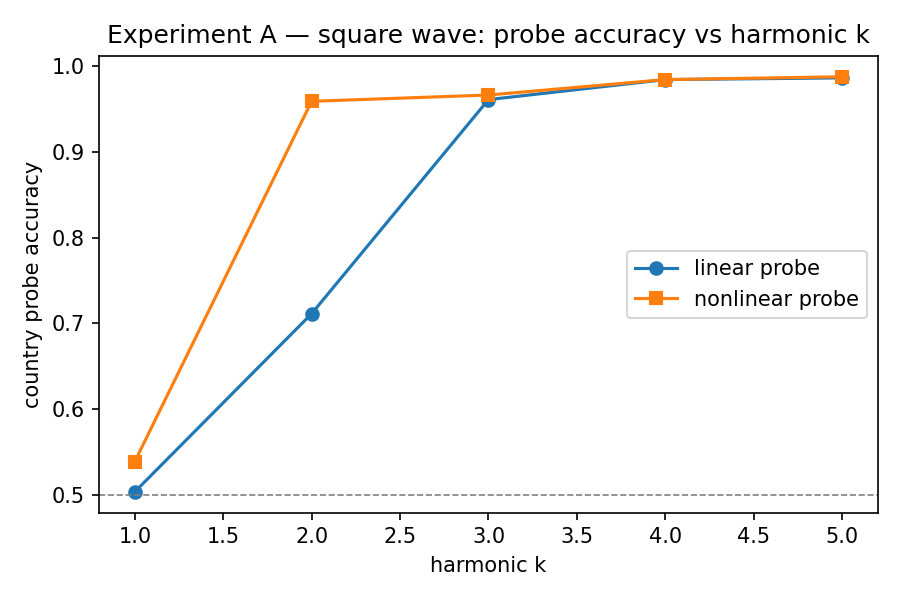{width=100%}

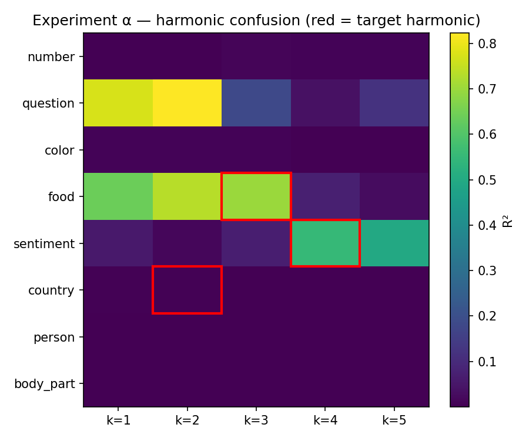{width=100%}

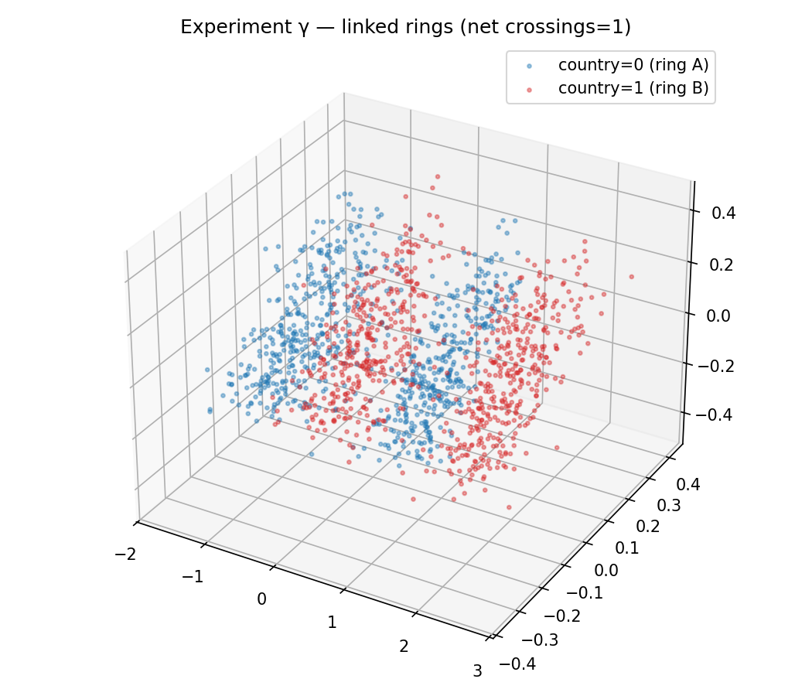{width=100%}
:::

# Conclusion

Tasks 1 and 2 identify a localized nonlinear representation: country is hidden
from linear readout at `h2` by a sign-symmetric magnitude code tied to the food
direction, then relinearized at `h3`. The causal evidence does not support a
specific two-neuron decoder, an exact rank-1 mechanism, or a capacity-based origin
story.

Task 3 shows a more elaborate binary representation by embedding a ten-class
variable on a unit circle and reading parity from alternating arcs. On an
additional QMNIST audit set and across five frozen seeds, nonlinear parity probes
consistently outperform linear probes by a large margin. The seed variation is
part of the result: the construction is strongly probe-resistant on average,
but not perfectly immune to linear leakage.

# Reproducibility

The complete code and checked-in artifacts are in the
[public submission repository](https://github.com/janmenjayap/bluedot-tais-puzzle/tree/puzzle1-task1-harness),
a fork of the original puzzle repository. Clone the named analysis branch before
running any command below:

```bash
git clone --branch puzzle1-task1-harness https://github.com/janmenjayap/bluedot-tais-puzzle.git
cd bluedot-tais-puzzle
./setup.sh
conda activate bluedot-impact-puzzle-1-py311
pytest -q
```

`setup.sh` creates a Python 3.11 Conda environment, installs the version-bounded
dependencies in `requirements.txt` (including Torch 2.2 and torchvision 0.17),
and runs `pip check`. It does not alter or checksum the supplied model and text
data. `pytest -q` verifies activation taps, probe utilities, Task 3 models, and
the frozen MNIST/QMNIST protocol.

A branch can move. For an immutable citation, the final submitted repository
should be tagged after this report, its scripts, and its artifacts are committed,
and the tag should replace the branch name in the clone command. At the time of
writing the public fork has no release tag; this is a publication step, not a
claim that an uncommitted working tree is already archived.

## Verify the published evidence

The report can be checked without retraining. The first command verifies the
code; the next two display the frozen five-seed result and the hashes recorded
for the exact checkpoints used in the one-time audit:

```bash
pytest -q
cat artifacts/results/19_mnist_circular_audit_summary.csv
cut -d, -f1-2 artifacts/results/19_mnist_circular_audit_seeds.csv
shasum -a 256 artifacts/results/18_mnist_circular_seed_*.pt
```

The hashes printed by `shasum` should match the `checkpoint_sha256` column after
accounting for seed order. Protocol metadata and the pre-outcome loader event are
in `18_mnist_circular_protocol.json` and
`19_mnist_circular_audit_record.json`.

The supplied puzzle inputs used here have these SHA-256 hashes:

| Input | SHA-256 |
|:--|:--|
| `model.pt` | `4f8f69ed29609974fb9f6d1b00d0516bc2aeb49a5218673197b2916417c11175` |
| `data/train.jsonl` | `eeda858f7f73a1a8dea6661d5dd225f811717aa3cc5d660267ec2b60da767cce` |
| `data/test.jsonl` | `4e92dac8ef0658e0cb1be51486a2ce6c647ae2246f712560402f1e8480d6f046` |
| `feature_names.json` | `d77a0c708d9702d7e20a2ef55b6c090e12d0f9d9192848e41e117d467a26d856` |

The checked-in HTML is self-contained. With Pandoc 3.9, regenerate it from the
auditable Markdown source and stylesheet as follows:

```bash
pandoc docs/writeup.md --standalone --toc --embed-resources --mathml \
   --syntax-highlighting=none --css docs/submission.css --output docs/report.html
```

## Reproduce Tasks 1 and 2

Run the analyses in dependency order from the repository root. These commands
rebuild the activation cache and the complete Tasks 1-2 evidence table:

```bash
for script in \
   00_cache_activations \
   01_sanity_check \
   02_linear_probes \
   03_nonlinear_probes \
   04a_significance \
   04b_template \
   04c_controls \
   04d_layer_trace \
   05_geometry \
   06_country_food \
   07_mechanism \
   07b_h3_circuit
do
   python "scripts/${script}.py"
done
```

The generated CSVs and figures are `artifacts/results/01_*` through
`artifacts/results/07b_*`; `artifacts/activations/acts.npz` is the shared cache.

## Independently rerun the confirmatory Task 3 audit

Task 3's frozen training entry point is
`scripts/18_train_mnist_circular.py`; it loads only the canonical MNIST training
partition. The audit entry point is
`scripts/19_analyze_mnist_circular.py`; it loads QMNIST `test50k` and deliberately
refuses to run while a completed audit CSV exists. In a disposable reproduction
clone, preserve the published artifacts before invoking the guarded path:

```bash
mkdir -p artifacts/published-mnist-audit
mv artifacts/results/18_mnist_circular_* \
    artifacts/results/19_mnist_circular_* \
    artifacts/published-mnist-audit/
python scripts/18_train_mnist_circular.py
python scripts/19_analyze_mnist_circular.py
diff -u artifacts/published-mnist-audit/19_mnist_circular_audit_summary.csv \
            artifacts/results/19_mnist_circular_audit_summary.csv
```

The frozen split, seeds, epoch count, learning rate, batch size, and geometry
weight are constants in `src/puzzle/mnist_protocol.py`. Python, Torch,
torchvision, and device metadata are written into the protocol JSON. Random
seeds are fixed, but exact checkpoint bytes can remain backend-dependent; the
published SHA-256 values identify the checkpoints supporting this report.

## Rerun the historical Task 3 archive

For completeness, the remaining Task 3 scripts run in the order below. They
train multiple models and can take substantially longer than the Tasks 1-2
analysis. Run them only in a disposable clone because they overwrite historical
artifacts. Their use of repeatedly inspected test data means rerunning them does
not convert their results into confirmatory evidence.

```bash
for script in \
   08_train_xor 09_analyze_xor \
   10_train_rotation 11_analyze_rotation \
   12_train_jepa 13_analyze_jepa \
   14_train_helix 15_analyze_helix \
   16_train_superposition 17_analyze_superposition \
   20_train_sae_h2 21_analyze_sae_h2 \
   22_cpd_puzzle_analytic \
   23_train_bilinear_xor 24_analyze_bilinear_xor \
   25_train_bilinear_text 26_analyze_bilinear_cpd \
   27_train_bottleneck 28_analyze_bottleneck \
   29_train_squarewave 30_analyze_squarewave \
   31_train_fourier_comb 32_analyze_fourier_comb \
   33_train_linked_rings 34_analyze_linked_rings
do
   python "scripts/${script}.py"
done
```

The script-to-experiment mapping is the numbered Task 3 ledger above. The
authoritative evidence classification is also recorded in `scripts/README.md`:
`18`/`19` are confirmatory, `00`-`07b` analyze the supplied fixed model under its
intended train/test split, and the other Task 3 runs are historical exploration.

# References

1. Alain, G., and Bengio, Y. (2016, revised 2018). "Understanding intermediate
   layers using linear classifier probes." arXiv:1610.01644.
   <https://arxiv.org/abs/1610.01644>
2. Elhage, N., et al. (2022). "Toy Models of Superposition." Transformer
   Circuits Thread. <https://transformer-circuits.pub/2022/toy_model/index.html>
3. Yadav, C., and Bottou, L. (2019). "Cold Case: The Lost MNIST Digits."
   Advances in Neural Information Processing Systems 32.
   <https://proceedings.neurips.cc/paper/2019/hash/51c68dc084cb0b8467eafad1330bce66-Abstract.html>
4. LeCun, Y., Bottou, L., Bengio, Y., and Haffner, P. (1998). "Gradient-Based
   Learning Applied to Document Recognition." Proceedings of the IEEE, 86(11),
   2278-2324. <https://doi.org/10.1109/5.726791>
